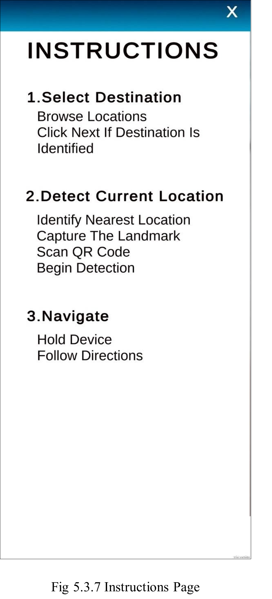
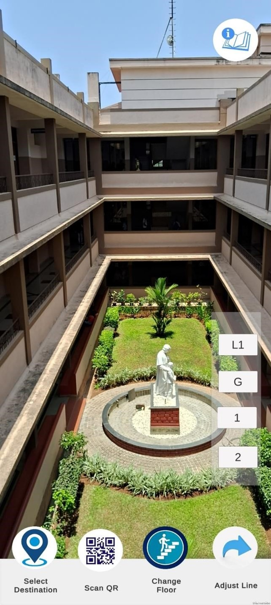
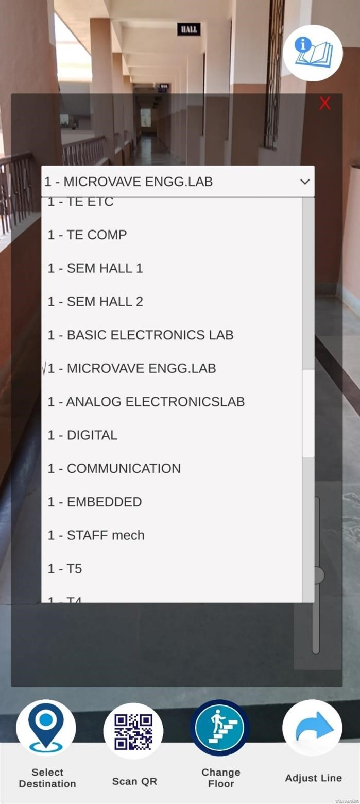
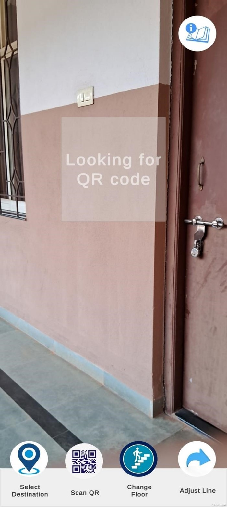
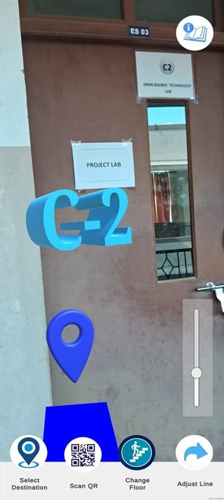

# 🏛️ ARROW: AR Indoor Navigation

ARROW is an **Augmented Reality Indoor Navigation** system designed to help users find their way inside buildings using AR overlays. With features like real-time path visualization, QR-based repositioning, and audio guidance, it enhances indoor navigation efficiency without requiring Wi-Fi or Bluetooth.

## 🚀 Features
- **Shortest Path Calculation** 📍
- **Real-Time Navigation with AR Overlays** 📡
- **QR Code-based Positioning & Repositioning** 🔲
- **Multi-Floor Navigation** 🏢
- **Customizable User Preferences** ⚙️
- **Audio-Based Directions** 🔊
- **Works Offline** 🚫📶

## 🎥 Demo Video
[](https://drive.google.com/file/d/1BeeknkZ24qwqvFBt72TI5EL4TW5bschC/view?usp=drive_link)

## 📸 Screenshots
### 1️⃣ Home Screen


### 2️⃣ Navigation Display


### 3️⃣ Instructions Page


### 4️⃣ Floor Selection


### 5️⃣ Destination Selection


### 6️⃣ QR Code Scan


### 7️⃣ Destination Marker in AR


## 📂 Repository Structure
```
📁 ARROW-AR-INDOOR-NAVIGATION
 ├── 📁 .vscode          # VS Code settings
 ├── 📁 Assets          # AR models, UI elements, etc.
 ├── 📁 Packages        # Unity packages
 ├── 📁 ProjectSettings # Unity project settings
 ├── 📄 .vsconfig       # Configuration file
 └── 📄 README.md       # This file
```

## 🔒 Disclaimer
This repository **does not contain the core script files** to protect the original project. It serves as a reference for project structure, assets, and UI design.

## 📜 License
This project is **not open-source** to prevent unauthorized use.

---
Enjoy seamless indoor navigation with **ARROW!** 🚀📍
